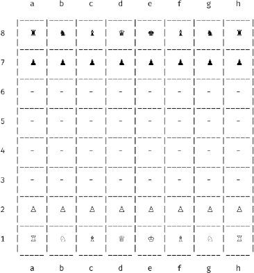

 # cchess
 ### `chess, but in the console`

 ## Disclaimer
 **STILL IN ACTIVE DEVELOPMENT**  
 For a list of the things that currently may or may not work, take a look at the [current feature set](./docs/FEATURESET.md).

#### What is this?
1. A Haskell library for chess:
   * Contains all necessary functionality a creator of a chess app or chess engine might need

2. A minimalistic way of playing chess in the console:
   * For those who just can't be bothered  

For more information, take a look at:
* [Using the chess library](./docs/API.md)
* [Playing a round of chess](./docs/GAME.md)